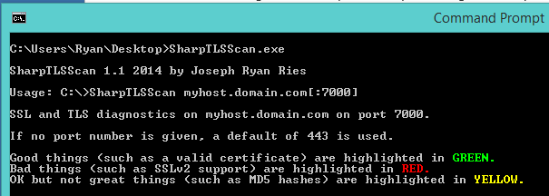
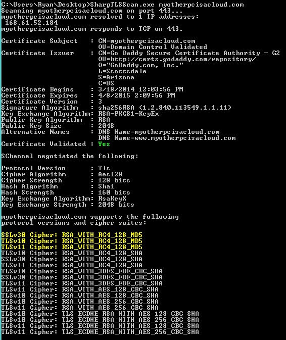

SharpTLSScan
============

This application scans a server to see what versions of SSL and TLS it supports, and which cipher suites.

It is very similar to a program named sslscan (http://sourceforge.net/projects/sslscan/) and sslscan-win (http://code.google.com/p/sslscan-win/) but those programs had not been updated in 5 years, and thus did not support TLS 1.1 or 1.2, which is why I wrote this tool.

